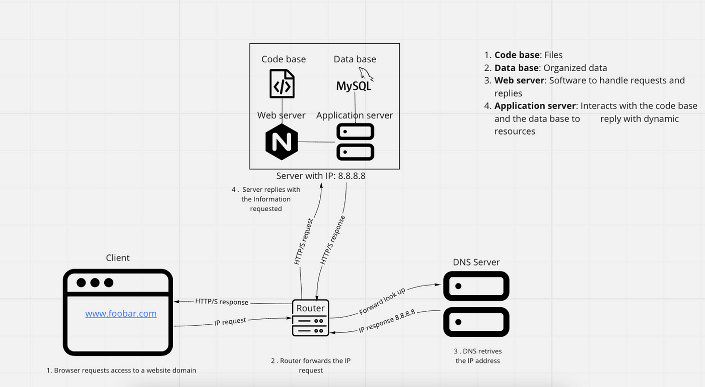

# Simple web stack

1. **Server**:
   - Purpose: The server hosts all components of the web infrastructure, including the web server, application server, and database.
   - Explanation: A server is a computer system or device that provides resources, services, or data to other computers or clients over a network.

2. **Domain Name (foobar.com)**:
   - Purpose: The domain name serves as the address for the website, allowing users to access it via a memorable and human-readable name.
   - Explanation: A domain name is a unique identifier for a website that maps to the IP address of the server hosting the website. It provides a user-friendly way to access web resources on the Internet.

3. **DNS Record (www)**:
   - Purpose: The www DNS record specifies the subdomain for accessing the website, indicating that the website is accessible via the World Wide Web.
   - Explanation: The www DNS record is a type of DNS (Domain Name System) record that resolves the subdomain `www.foobar.com` to the IP address of the server hosting the website.

4. **Web Server (Nginx)**:
   - Purpose: The web server handles incoming HTTP requests from users' web browsers, serves static content, and forwards dynamic requests to the application server.
   - Explanation: The web server acts as the front-end component of the web infrastructure, serving as the entry point for user requests and facilitating communication between the user's browser and the application server.

5. **Application Server**:
   - Purpose: The application server hosts the application logic and processes dynamic content such as API requests, database queries, and business logic.
   - Explanation: The application server executes the codebase of the website, generating dynamic content and interacting with the database to fulfill user requests.

6. **Application Files (Code Base)**:
   - Purpose: The application files contain the source code of the website, including HTML, CSS, JavaScript, server-side scripts (e.g., PHP, Python), and other assets.
   - Explanation: The application files define the functionality and behavior of the website, determining how it responds to user interactions and displays content to visitors.

7. **Database (MySQL)**:
   - Purpose: The database stores and manages the website's data, including user information, content, and session data.
   - Explanation: The database provides persistent storage for the website's data, allowing for efficient retrieval, manipulation, and organization of information used by the application.

**Issues with the Infrastructure**:

1. **Single Point of Failure (SPOF)**:
   - The infrastructure has a single server, which poses a risk of failure if the server experiences hardware or software issues.
   - If the server goes down, the entire website becomes inaccessible to users, leading to downtime and potential loss of business.

2. **Downtime During Maintenance**:
   - Performing maintenance tasks such as deploying new code or updating software may require restarting the web server, causing temporary downtime for the website.
   - During maintenance windows, users may experience interruptions in service, impacting their ability to access the website and its services.

3. **Limited Scalability**:
   - The infrastructure may struggle to handle a sudden influx of incoming traffic or increased user demand, limiting its ability to scale effectively.
   - Without additional resources or infrastructure components, the website may become slow or unresponsive during periods of high traffic, leading to a poor user experience.
