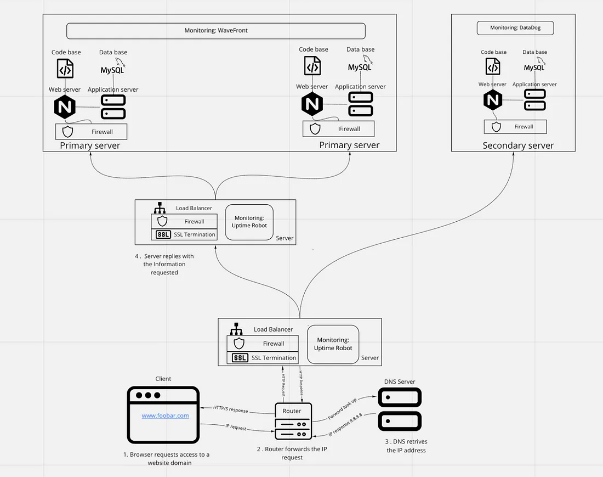

# Scale up

1. **Server**:
   - Purpose: The server acts as the host for the various components of the web infrastructure.
   - Explanation: A single server is used to host all the components, providing the necessary computing resources for running the web server, application server, and database.

2. **Load Balancer (HAproxy)**:
   - Purpose: The load balancer distributes incoming traffic across multiple servers to improve performance, scalability, and reliability.
   - Explanation: By configuring HAproxy as a cluster with multiple instances, we ensure high availability and fault tolerance. If one load balancer instance fails, traffic is automatically routed to the remaining instances, preventing downtime.

3. **Web Server**:
   - Purpose: The web server handles incoming HTTP requests, serves static content, and forwards dynamic requests to the application server.
   - Explanation: Separating the web server from the application server allows for better resource management and scalability. The web server specializes in serving web pages and static content, while the application server focuses on executing application logic and processing dynamic requests.

4. **Application Server**:
   - Purpose: The application server hosts the application logic and processes dynamic content such as API requests, database queries, and business logic.
   - Explanation: Isolating the application server allows for scalability and flexibility. As the application grows, additional application server instances can be added to handle increased traffic and workload without affecting the web server or database.

5. **Database Server**:
   - Purpose: The database server stores and manages the website's data, including user information, content, and session data.
   - Explanation: Separating the database server ensures data integrity, scalability, and performance. It allows for dedicated resources and optimized configuration tailored to the database workload, improving reliability and efficiency.

By splitting the components into separate servers, we achieve better scalability, fault tolerance, and resource utilization. Each component can be scaled independently based on demand, allowing for seamless expansion as the application grows. Additionally, isolating the components improves security and simplifies maintenance and troubleshooting efforts.
